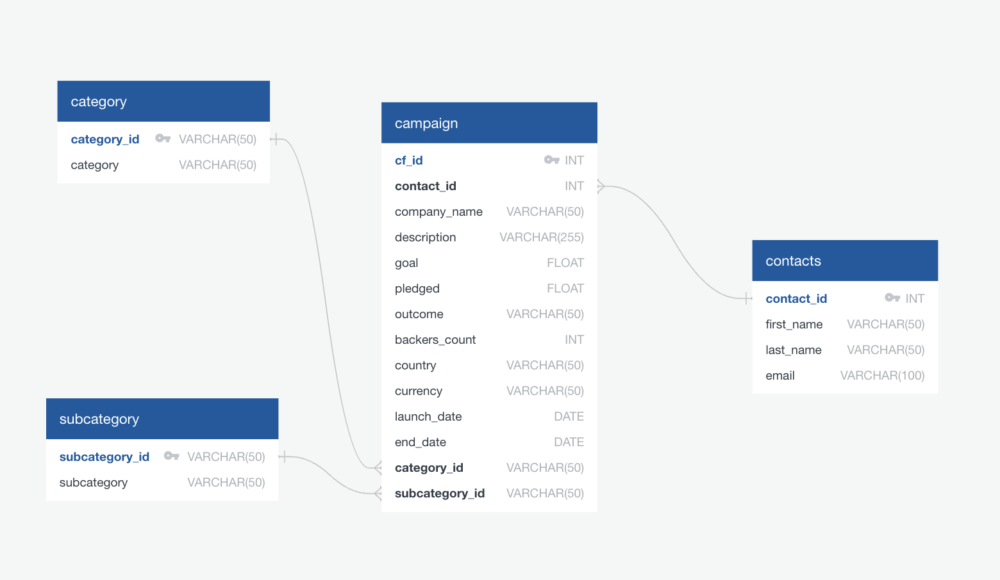
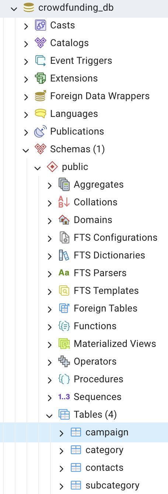
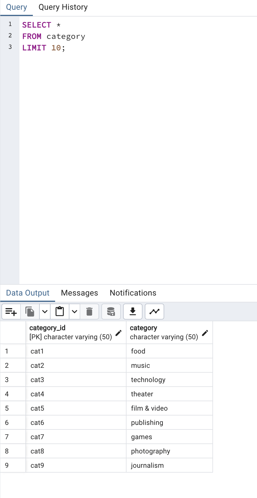
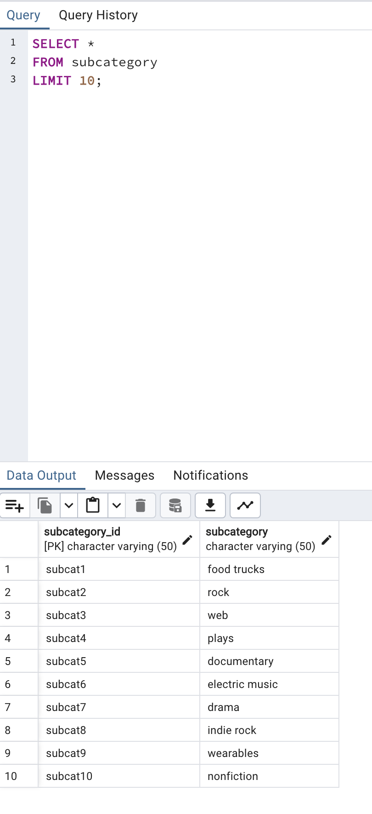
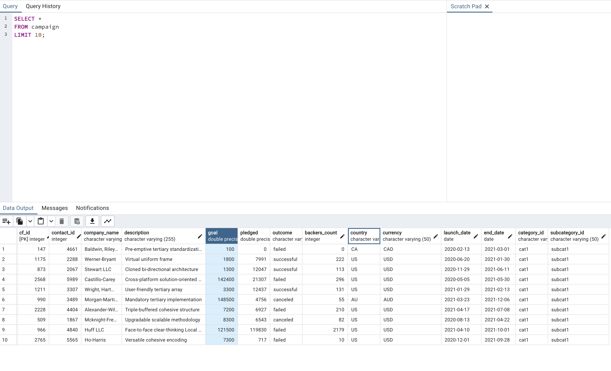

# Crowdfunding_ETL
This project aimed to perform the Extract, Load, and Transform (ETL) process using a dataset with crowdfunding data. The process involved extracting data from an Excel spreadsheet, and finally, using PostGres, four tables called category, subcategory, campaign, and contacts were created in a crowdfunding database. Below is the entity relationship diagram of the final database.

The first extraction step involved using Python and Pandas to extract the data of interest from an Excel spreadsheet and transform the data into separate dataframes. From here, Pandas was used to split applicable columns into two (e.g., a column originally called "category & subcategory" was divided into separate columns called "category" and "subcategory"). Pandas was also used to reassign data types within the dataframes. The four dataframes were exported into separate .CSV files, resulting in the four tables within the crowdfunding database.

An image of the database within Postgres follows:

These are the resulting tables, with a simple SELECT statement showing how they were structured and what they contained.

# Category Table:

# Subcategory Table:

# Contacts Table:

# Campaign Table:

