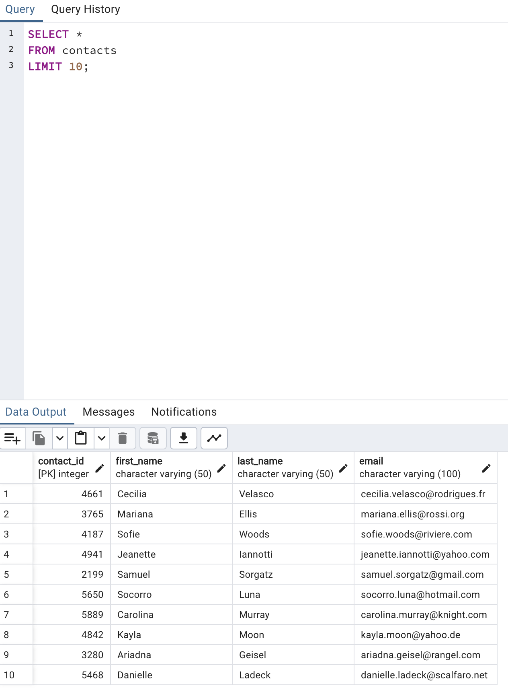

# Crowdfunding_ETL
The goal of this project was to perform the Extract, Load, and Transform (ETL) process using a dataset with crowdfunding data. The process involved extracting data from an Excel spreadsheet and finally using PostGres, four tables called category, subcategory, campaign, and contacts were created in a crowdfunding database. Below is the entity relationship diagram of the final database.

The first step of extraction involved using python and Pandas to extract the data of interest from an Excel spreadsheet and transform the data into separate dataframes. From here, Pandas was used to split applicable columns into two (e.g. a column originally called "category & subcategory" was split into separate columns called category and subcategory). Pandas was also used to reassign data types within the dataframes. The four dataframes were then exported into separate .CSV files to that would result in the four different tables within the crowdfunding database.

This is the way that the database is set up in PostGres:

These are the resulting tables with a simple SELECT statement showing how the tables were structured and what they contain.

# Category Table:

# Subcategory Table:

# Contacts Table:

# Campaign Table:

